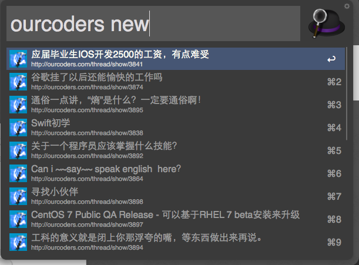

workflow.ourcoders
==================

workflow for http://ourcoders.com  


Description
===========
这是一个通过命令查看 [OurCoders](http://ourcoders.com) 的讨论最新、最热、最冷帖子的workflow。  
借鉴了[v2ex](https://github.com/hzlzh/Alfred-Workflows#v2ex-v10)的那个插件，以及[FindYYeTs](https://github.com/jackychi/FindYYeTs) 完成的。  

具体教程： [敬请期待...]()


Development
===========

OurCoders.workflow 使用的是Python 2.7开发的。  

使用的了urllib2下载网站内容，然后通过正则匹配(re模块)获取相应的文章标题与链接。  


Requirements
============

+ Python 2.7 (系统自带)
+ Alfred 2   (免费)
+ Powerpack  (收费)


Installation
============

下载 [OurCoders.alfredworkflow](https://github.com/sser-huangdong/workflow.ourcoders/blob/master/OurCoders.alfredworkflow?raw=true), 双击导入Alfred 2即可


Usage
=====

1.. 通过热键(默认是```option+space```)呼出Alfred；  
2.1 通过```ourcoders new```获取最新帖子；  
2.2 通过```ourcoders hot```获取最热帖子；  
2.3 通过```ourcoders cold```获取最冷帖子。  
P.S. 输入正确的命令之后可能由于网络原因没有及时响应，相应提醒稍后添加。  



Todo
====

1. 使用像素更高的图标 -- Done
2. 编写入门教程
3. 添加加载中的提醒功能
4. 思考添加更多功能

