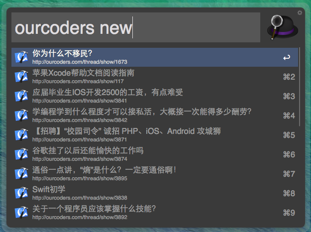

workflow.ourcoders
==================

workflow for http://ourcoders.com  
这是一个通过命令查看 [ourcoders](http://ourcoders.com) 的讨论最新、最热、最冷文章的workflow。  
借鉴了v2ex的那个插件，以及FindYYeTs 完成的。  
使用的语言是python。  

具体教程： [敬请期待]()

Requirements
============

+ Python 2.7
+ Alfred 2
+ PowerPack

Installation
============

下载 [OurCoders.alfredworkflow](), 双击导入Alfred 2即可

How to use
==========

通过热键(默认是```option+space```)呼出Alfred,  
然后通过```ourcoders new```获取最新文章,  
通过```ourcoders hot```获取最热文章,  
通过```ourcoders cold```获取最冷文章。  



